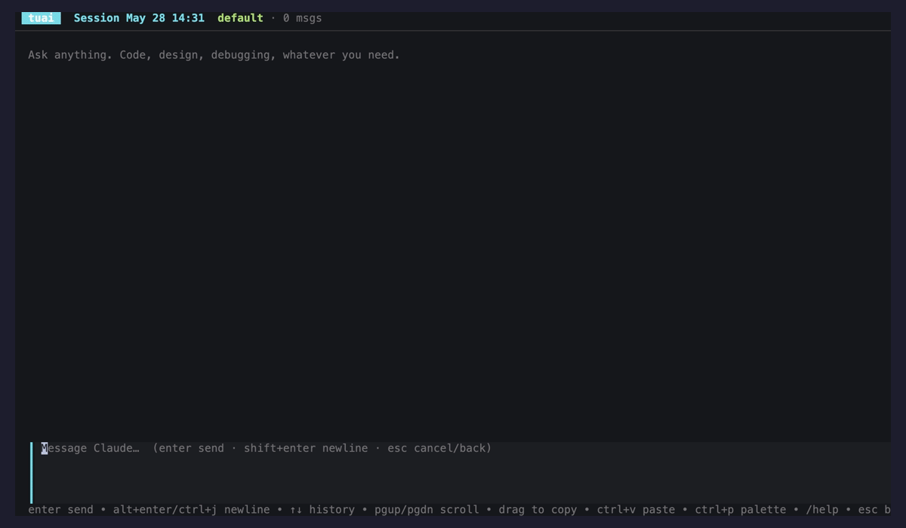

In my opinion much nicer UIX around ussing claude code.
Came from hurting my eyes reading the output from claude code. I wanted something that cleanly separates my input from its output.

Its written in go using Bubbletea library.
Basically calls claude code in headless mode and prompts it.
No extra toekn usage.

Supports:
- Syntax highlighting
- Vim motions
- Renaming sessions
- Changing models
- Theme selection
- Animations around agents actions
- Interactive answers to Claude's questions (AskUserQuestion) — pick options with ↑↓ / number keys, or just type your own reply

## Demo

The gif above is generated from `docs/demo.tape` with [VHS](https://github.com/charmbracelet/vhs):

```sh
brew install vhs
make build
vhs docs/demo.tape   # writes docs/demo.gif
```
